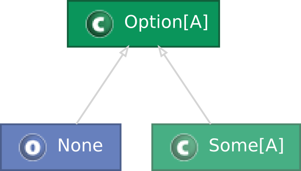

Title:  Abstract Algebraic Data Type
Slug: abstract-algebraic-data-type

Scala's sealed class hierarchies (aka. [Algebraic Data Types](https://en.wikipedia.org/wiki/Algebraic_data_type)) are for sure one of its most praised features. Yet, they have one downside: they don't let us abstract over the type hierarchy as `trait`s and `class`es are all about constructing new **concrete** types.

In this post, we will explore how we can relax this constraint so that we can get an abstracted version of `scala.Option`, which would allow us to switch implementations.


Deconstructing Scala's algebraic data types {id="deconstructing"}
-------------------------------------------

As a reminder, here is [how Scala's `Option`s are implemented](https://github.com/scala/scala/blob/2.11.x/src/library/scala/Option.scala):

```scala
sealed abstract class Option[+A]
final case class Some[+A](x: A) extends Option[A]
case object None extends Option[Nothing]
```

Here is the corresponding scaladoc diagram:

[](scala-option.png)

There are quite a few things happening here:
* we need to be able to speak about the **types and their relationships**;
* then we need a way to **inject** values in those types;
* finally we need a way to inspect the values for those types to **extract** their content.

On types and subtyping {id="type-and-relationships"}
----------------------

There is a **subtyping relationship** between `Some`/`None` and `Option`.

Actually, `None` itself is not a type but a value, whose type is `None.type`, a subtype of `Option`. Also, `Option` and `Some` are not technically types, but **type constructors** (aka. [higher kinded types](https://stackoverflow.com/questions/6246719/what-is-a-higher-kinded-type-in-scala)): we need to provide a type `A` to produce an `Option[A]` type.

Finally, `Option` is covariant in its parameterized type `A`, so that `Option[Nothing]` is a subtype of `Option[A]` because [`Nothing` is a sybtype of any type](https://stackoverflow.com/questions/1728541/if-the-nothing-type-is-at-the-bottom-of-the-class-hierarchy-why-can-i-not-call).

On injectors {id="injectors"}
------------

We have two (here somewhat equivalent) ways of **injecting** a value of type `A` into a `Some[A]`:

* we can do that through the class constructor, eg. `new Some(42)`
* or more natually through `Some.apply`, eg. `Some(42)`

`None` is a singleton object, therefore it is the *only inhabitant* of `None.type`.

On extractors {id="extractors"}
-------------

Given an `Option[A]`, we can reason by cases using **pattern matching**.

This is achieved through the [`unapply` extractor methods](http://docs.scala-lang.org/tutorials/tour/extractor-objects.html) on the `Option` companion object. And because `Option` is sealed, the type checker will be able to check for exhaustiveness.

Finally, given a `Some[A]`, we can retrieve its content through the `x` field accessor, or again using the `Some.unapply` extractor.


Abstracting over types {id="abstracting-over-types"}
----------------------

My colleague [Dan](https://twitter.com/dwhjames) explored [how to encode modules in Scala](http://io.pellucid.com/blog/scalas-modular-roots) in a previous blog article. If you haven't read it yet, I warmly recommend you to do it, even if not strictly necessary for understanding what is going on here. Also here, I will choose yet another encoding using a [typeclass](https://en.wikipedia.org/wiki/Type_class) approach.

First, let's gather all the type hierarchy in one place:

```scala
import scala.language.higherKinds

trait OptionSig {
  type Option[+_]
  type Some[+A] <: Option[A]
  type None <: Option[Nothing]
}
```

I use the `Sig` suffix as if `OptionSig` was an [ML module signature](http://caml.inria.fr/pub/docs/oreilly-book/html/book-ora131.html) but this is **not the complete signature** as there are no function defined in this trait.

This is just a convenient way to gather several types into a single one, a bit like a record but for types. Given an `OptionSig`, we can speak about one of the types it contains using a type projection, eg. `OptionSig#Option[A]`.


Abstracting over operations
---------------------------

Now that we have type hierarchy, we can complete our signature with the operations that must be defined over it:

```scala
abstract class OptionOps[Sig <: OptionSig] {
  def some[A](x: A): Sig#Some[A]
  def none: Sig#None
  def fold[A, B](opt: Sig#Option[A])(ifNone: => B, ifSome: A => B): B
}
```

You might be wondering why I need this `Sig` as a subtype for `OptionSig`, as this is usually not needed for typeclasses. It's because I need to be able to project the inner types.

`some[A]` is the injector for `Sig#Some[A]`. `none` doesn't take any parameter, so it acts as a singleton for `Sig#None`.

`fold[A, B]` totally defines the type `Sig#Option[A]` through the two passed functions, which can react on the actual type for `opt` at runtime:

* if `opt` was a `Sig#None`, then `ifNone` is returned (notice that it is a lazy parameter which is only computed if needed)
* if `opt` was a `Sig#Some[A]`, then `ifSome` has access to the contained value to compute its result

Finally, we can define a helper to retrieve an instance of `OptionOps[Sig]` given a signature (if it exists!):

```scala
object OptionOps {

  def apply[Sig <: OptionSig](implicit ops: OptionOps[Sig]): OptionOps[Sig] = ops

}
```

Functions over `OptionSig`/`OptionOps`
--------------------------------------

We now want to define new structures that depends on our module. For this, we need something similar to [ML functors](http://caml.inria.fr/pub/docs/oreilly-book/html/book-ora131.html).

For example, let's define a functor that can construct instances of `scalaz.Show` for us:

```scala
import scalaz.Show

class OptionShow[Sig <: OptionSig : OptionOps] {

  def optionShow[A : Show]: Show[Sig#Option[A]] = {

    // retrieving the typeclass instances
    val showA = Show[A]
    val ops = OptionOps[Sig]

    val instance = new Show[Sig#Option[A]] {
      override def shows(opt: Sig#Option[A]): String = ops.fold(opt)(
        "none",
        x => s"some(${showA.shows(x)})"
      )
    }

    instance
  }

}

object OptionShow {

  implicit def apply[Sig <: OptionSig : OptionOps]: OptionShow[Sig] = new OptionShow[Sig]

}
```

Wow, so many weird notations thrown at your face all at once! And you probably don't know all of them. Let's see what's happening.

`OptionShow[Sig <: OptionSig : OptionOps]` means that `OptionShow` is parameterized by a `Sig`, which is required to be a subtype of `OptionSig`, and a instance of `OptionOps[Sig]` must also be **implicitly** available

`def optionShow[A : Show]: Show[Sig#Option[A]]` means that if we can provide an instance of `Show[A]`, then `optionShow` can construct an instance of `Show[Sig#Option[A]]` for us.

This `scalaz.Show` is quite simple, yet powerful. It simply provides a `shows` function for instances of the provided type (here `Sig#Option[A]`). The trick here is that unlike `Object#toString()`, our `Show` instances are driven by types, so we can rely on a `Show[A]` being available.


A simple implementation
-----------------------

We have almost everything in place, we just need to provide an implementation for our module.

`scala.Option` looks like a good candidate, after all that's where we started from:

```scala
trait ScalaOption extends OptionSig {

  type Option[+A] = scala.Option[A]

  type Some[+A]   = scala.Some[A]

  type None       = scala.None.type

}

object ScalaOption {

  implicit object ops extends OptionOps[ScalaOption] {

    def some[A](x: A): ScalaOption#Some[A] = scala.Some(x)

    val none: ScalaOption#None = scala.None

    def fold[A, B](opt: ScalaOption#Option[A])(ifNone: => B, ifSome: A => B): B =
      opt match {
        case scala.None    => ifNone
        case scala.Some(x) => ifSome(x)
      }

  }

}
```

Nothing fancy here. We just plugged (aka. aliased) our types to the concrete ones. `some` and `none` trivially delegate to `Some.apply` and the `None` singleton. Finally, the `fold` implementation relies on pattern matching.

Just note that the typeclass instance for `OptionOps[ScalaOption]` is made available in the companion object for `ScalaOption` so that [it will **always** be picked up by Scala when searching for such an implicit](http://eed3si9n.com/implicit-parameter-precedence-again).


Using our option
----------------

Finally, we can write a program using our shiny abstractions :-)

```scala
class Program[Sig <: OptionSig : OptionOps] extends App {

  val ops = OptionOps[Sig]
  import ops._

  // a little dance to derive our Show instance
  import scalaz.std.anyVal.intInstance
  val showOptOptInt = {
    implicit val showOptInt = OptionShow[Sig].optionShow[Int]
    OptionShow[Sig].optionShow[Sig#Option[Int]]
  }

  // scalaz's syntax tricks are awesome
  import showOptOptInt.showSyntax._

  val optOpt = some(some(42))

  println("optOpt: " + optOpt.shows)

  val optNone = some(none)

  println("optNone: " + optNone.shows)

}
```

We can plug everything together:

```scala
scala> object MainWithScalaOption extends Program[ScalaOption]
defined object MainWithScalaOption

scala> MainWithScalaOption.main(Array())
optOpt: some(some(42))
optNone: some(none)
```


Our own module implementation
-----------------------------

Turns out there are many ways to implement our module.

Here is a version of our module where we create our own classes:

```scala
object MyOption extends OptionSig {

  sealed abstract class Option[+A]

  final case class Some[+A](x: A) extends Option[A]

  sealed abstract class None extends Option[Nothing]
  case object None extends None

  implicit object ops extends OptionOps[MyOption.type] {

    def some[A](x: A): MyOption.type#Some[A] = Some(x)

    val none: MyOption.type#None = None

    def fold[A, B](opt: MyOption.type#Option[A])(ifNone: => B, ifSome: A => B): B =
      opt match {
        case None    => ifNone
        case Some(x) => ifSome(x)
      }
  }

}
```

Notice that our signature lies in the singleton type `MyOption.type` and that Scala will have no issue finding the implicit instance in itself: the companion object for the singleton type of a singleton object is itself!

I have introduced an `abstract class None` so that I don't need to define a type alias. It also is interesting to see that Scala doesn't require us to define our classes outside of `MyOption` to later alias them: we just do everything at once.


Java8-based implementation
--------------------------

Now, let's reuse Java 8 `java.util.Optional`!

```scala
import java.util.Optional
import java.util.function.{ Function => F, Supplier }

trait Java8Option extends OptionSig {

  type Option[+A] = Optional[_ <: A]

  type Some[+A]   = Optional[_ <: A]

  type None       = Optional[Nothing]

}

object Java8Option {

  implicit object ops extends OptionOps[Java8Option] {

    def some[A](x: A): Java8Option#Some[A] = Optional.of(x)

    val none: Java8Option#None = Optional.empty()

    def fold[A, B](opt: Java8Option#Option[A])(ifNone: => B, ifSome: A => B): B = {
      def f = new F[A, B] { def apply(a: A): B = ifSome(a) }
      def supplier = new Supplier[B] { def get(): B = ifNone }
      opt.map[B](f).orElseGet(supplier)
    }

  }

}
```


`Any`-based implementation
--------------------------

This implementation may my favourite:

```scala
trait NullOption extends OptionSig {

  type Option[+A] = Any

  type Some[+A]   = Any

  type None       = Null

}

object NullOption {

  implicit object ops extends OptionOps[NullOption] {

    def some[A](x: A): NullOption#Some[A] = x

    val none: NullOption#None = null

    def fold[A, B](opt: NullOption#Option[A])(ifNone: => B, ifSome: A => B): B = {
      if (opt == null) ifNone
      else ifSome(opt.asInstanceOf[A])
    }

  }

}
```

Yes, that's right, we are relying on `null` for our module, but this is completely typesafe as it never leaks outside of the abstraction. The trick is that `Null`, just like `Nothing`, is a subtype of `Any`. And you can note that that there is **no wrapping involved**.


Back to our program
-------------------

We now have four implementations of our option module, all behaving the same way:

```scala
scala> object MainWithScalaOption extends Program[ScalaOption]
defined object MainWithScalaOption

scala> MainWithScalaOption.main(Array())
optOpt: some(some(42))
optNone: some(none)

scala> object MainWithJava8Option extends Program[Java8Option]
defined object MainWithScalaOption

scala> MainWithJava8Option.main(Array())
optOpt: some(some(42))
optNone: some(none)

scala> object MainWithMyOption extends Program[MyOption.type]
defined object MainWithMyOption

scala> MainWithMyOption.main(Array())
optOpt: some(some(42))
optNone: some(none)

scala> object MainWithNullOption extends Program[NullOption]
defined object MainWithNullOption

scala> MainWithNullOption.main(Array())
optOpt: some(some(42))
optNone: none
```

How cool is that?


Summary
-------

Through a very simple example, we have seen how to abstract Algebraic Data Types: we started with a trait gathering the whole type hierarchy (type names, subtyping relationships, and variance), and we then defined a typeclass for such a signature for the operations to manipulate the abstract datatypes (injector and extractors). I hope to have shown that typeclasses are a great alternative to the cake pattern when it comes to encode modules in Scala.

In practice, some variations are possible. For example, we could ignored the subtyping relationships altogether. We would have end up with something closer to what happens in OCaml or Haskell as the constructors would both return a `OptionSig#Option[A]`. Also, it is easy to define syntaxic enhancement, so that one could directly write something like `myOption.fold("42", x => x.toString)`.

The techniques described in this article are particularly interesting when it comes to expose existing Java libraries to Scala, because there is no wrapping involved. And that it the very reason why they were used in [Banana-RDF](https://github.com/w3c/banana-rdf/blob/master/rdf/common/src/main/scala/org/w3/banana/RDF.scala), where there are already three different implementations: Jena and Sesame (two competting Java libraries for RDF), and a pure Scala implementation. An `rdfstore-js` implementation is in the work using Scala-js.
